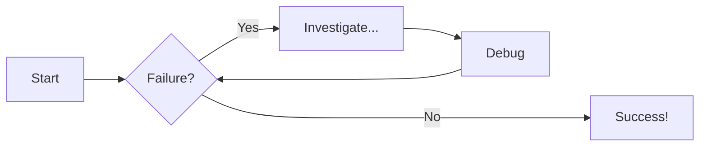

# Welcome to MkDocs

For full documentation visit [mkdocs.org](https://www.mkdocs.org).

## Commands

- `mkdocs new [dir-name]` - Create a new project.
- `mkdocs serve` - Start the live-reloading docs server.
- `mkdocs build` - Build the documentation site.
- `mkdocs -h` - Print help message and exit.

## Project layout

```js title="Code Title"
    mkdocs.yml    # The configuration file.
    docs/
        index.md  # The documentation homepage.
        ...       # Other markdown pages, images and other files.
```

## Babu

## Nobin

icon :beers:

### Generic Content

=== "Plain text"

    This is some plain text

=== "Unordered list"

    * First item
    * Second item
    * Third item

=== "Ordered list"

    1. First item
    2. Second item
    3. Third item

!!! note "Title of the callout"

    Lorem ipsum dolor sit amet, consectetur adipiscing elit. Nulla et euismod
    nulla. Curabitur feugiat, tortor non consequat finibus, justo purus auctor
    massa, nec semper lorem quam in massa.

Collapsible callout:

??? info "Collapsible callout with info icon"

    Lorem ipsum dolor sit amet, consectetur adipiscing elit. Nulla et euismod
    nulla. Curabitur feugiat, tortor non consequat finibus, justo purus auctor
    massa, nec semper lorem quam in massa.

# Diagram Examples

## Flowcharts



Lorem ipsum dolor sit amet, (1) consectetur adipiscing elit.
{ .annotate }

1.  :man_raising_hand: I'm an annotation! (1)
    { .annotate }

    1.  :woman_raising_hand: I'm an annotation as well!

[Subscribe to our newsletter](#){ .md-button }
[Subscribe to our newsletter](#){ .md-button .md-button--primary }
[Send :fontawesome-solid-paper-plane:](#){ .md-button }

| Method   | Description                          |
| -------- | ------------------------------------ |
| `GET`    | :material-check: Fetch resource      |
| `PUT`    | :material-check-all: Update resource |
| `DELETE` | :material-close: Delete resource     |

|  Method  |             Description              |
| :------: | :----------------------------------: |
|  `GET`   |   :material-check: Fetch resource    |
|  `PUT`   | :material-check-all: Update resource |
| `DELETE` |   :material-close: Delete resource   |

Lorem ipsum[^1] dolor sit amet, consectetur adipiscing elit.[^2]

[^2]:
    Lorem ipsum dolor sit amet, consectetur adipiscing elit. Nulla et euismod
    nulla. Curabitur feugiat, tortor non consequat finibus, justo purus auctor
    massa, nec semper lorem quam in massa.

Text can be {--deleted--} and replacement text {++added++}. This can also be
combined into {~~one~>a single~~} operation. {==Highlighting==} is also
possible {>>and comments can be added inline<<}.

{==

Formatting can also be applied to blocks by putting the opening and closing
tags on separate lines and adding new lines between the tags and the content.

==}

<div class="grid cards" markdown>

- :fontawesome-brands-html5: **HTML** for content and structure
- :fontawesome-brands-js: **JavaScript** for interactivity
- :fontawesome-brands-css3: **CSS** for text running out of boxes
- :fontawesome-brands-internet-explorer: **Internet Explorer** ... huh?

</div>

<div class="grid cards" markdown>

- :material-clock-fast:{ .lg .middle } **Set up in 5 minutes**

  ***

  Install [`mkdocs-material`](#) with [`pip`](#) and get up
  and running in minutes

  [:octicons-arrow-right-24: Getting started](#)

- :fontawesome-brands-markdown:{ .lg .middle } **It's just Markdown**

  ***

  Focus on your content and generate a responsive and searchable static site

  [:octicons-arrow-right-24: Reference](#)

- :material-format-font:{ .lg .middle } **Made to measure**

  ***

  Change the colors, fonts, language, icons, logo and more with a few lines

  [:octicons-arrow-right-24: Customization](#)

- :material-scale-balance:{ .lg .middle } **Open Source, MIT**

  ***

  Material for MkDocs is licensed under MIT and available on [GitHub]

  [:octicons-arrow-right-24: License](#)

</div>

<div class="grid" markdown>

:fontawesome-brands-html5: **HTML** for content and structure
{ .card }

:fontawesome-brands-js: **JavaScript** for interactivity
{ .card }

:fontawesome-brands-css3: **CSS** for text running out of boxes
{ .card }

> :fontawesome-brands-internet-explorer: **Internet Explorer** ... huh?

</div>
{ align=left }
{ align=right }
<figure markdown="span">
  { width="300" }
  <figcaption>Image caption</figcaption>
</figure>


- Nulla et rhoncus turpis. Mauris ultricies elementum leo. Duis efficitur
  accumsan nibh eu mattis. Vivamus tempus velit eros, porttitor placerat nibh
  lacinia sed. Aenean in finibus diam.

  - Duis mollis est eget nibh volutpat, fermentum aliquet dui mollis.
  - Nam vulputate tincidunt fringilla.
  - Nullam dignissim ultrices urna non auctor.

1.  Vivamus id mi enim. Integer id turpis sapien. Ut condimentum lobortis
    sagittis. Aliquam purus tellus, faucibus eget urna at, iaculis venenatis
    nulla. Vivamus a pharetra leo.

    1.  Vivamus venenatis porttitor tortor sit amet rutrum. Pellentesque aliquet
        quam enim, eu volutpat urna rutrum a. Nam vehicula nunc mauris, a
        ultricies libero efficitur sed.

    2.  Morbi eget dapibus felis. Vivamus venenatis porttitor tortor sit amet
        rutrum. Pellentesque aliquet quam enim, eu volutpat urna rutrum a.

        1.  Mauris dictum mi lacus
        2.  Ut sit amet placerat ante
        3.  Suspendisse ac eros arcu

- [x] Lorem ipsum dolor sit amet, consectetur adipiscing elit
- [ ] Vestibulum convallis sit amet nisi a tincidunt
  - [x] In hac habitasse platea dictumst
  - [x] In scelerisque nibh non dolor mollis congue sed et metus
  - [ ] Praesent sed risus massa
- [ ] Aenean pretium efficitur erat, donec pharetra, ligula non scelerisque

[Hover me](https://example.com "I'm a tooltip!")
:material-information-outline:{ title="Important information" }

```markdown
[Attribute Lists](#){ data-preview }
```
